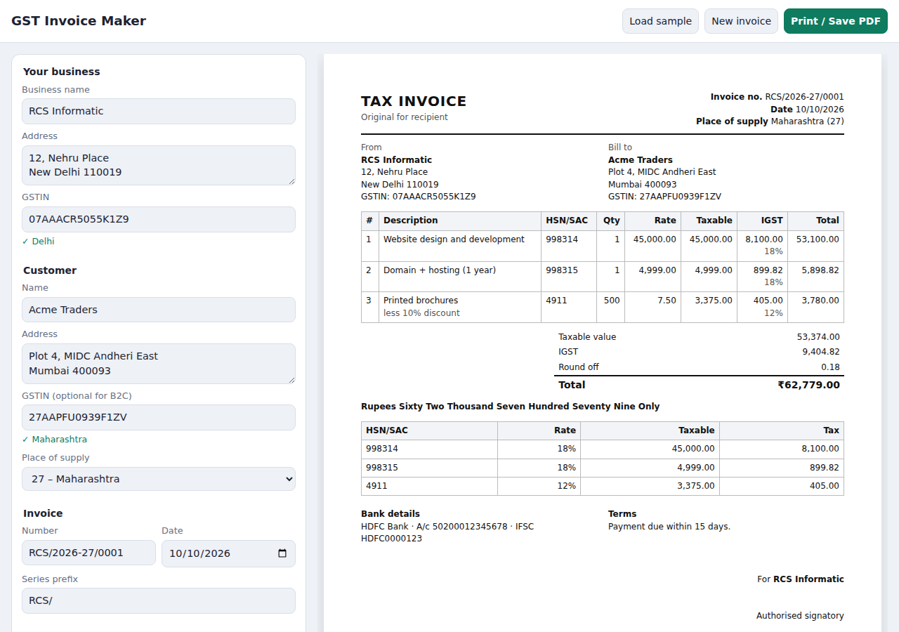

# GST Invoice Maker

[](https://github.com/Sumitrcs/gst-invoice-maker/actions/workflows/ci.yml) 

Make a proper Indian **GST tax invoice** in your browser and save it as an A4 PDF.
There is no sign-up and no server. Your data stays in your browser's local storage and is never uploaded.

**Live:** https://sumitrcs.github.io/gst-invoice-maker/



## Features

- **GSTIN check.** It checks the format, the state code and the **check digit**, so a typo like `27AAPFU0939F1ZW` is caught: *"Check digit should be V"*.
- **The right tax automatically.** A sale within one state gets CGST + SGST, a sale to another state gets IGST, and a Union Territory without a legislature gets UTGST.
- The **place of supply** is picked from the customer's GSTIN. You can change it, and leave the GSTIN empty for B2C sales.
- **Per-line discounts, fractional quantities** (2.5 kg) and every GST slab: 0, 0.25, 3, 5, 12, 18, 28 and 40%.
- An **HSN/SAC summary**, **round-off** to the nearest rupee and the **amount in words** in Indian style ("Sixty Two Thousand…", "Two Crore…").
- **Invoice numbers per financial year** (`INV/2026-27/0001`). The series restarts every April.
- **Print / Save PDF** gives a clean A4 page with the editor hidden.

## Run it

```bash
npx serve .       # or: python3 -m http.server
# open http://localhost:3000 and click "Load sample"
npm test          # 9 tests, no dependencies
```

## Example

The sample is a Delhi business billing a Mumbai customer, so it is inter-state and uses IGST:

| Item | Qty × Rate | Discount | Taxable | GST | IGST |
|---|---|---|---:|---|---:|
| Website design and development | 1 × 45,000.00 | – | 45,000.00 | 18% | 8,100.00 |
| Domain + hosting (1 year) | 1 × 4,999.00 | – | 4,999.00 | 18% | 899.82 |
| Printed brochures | 500 × 7.50 | 10% | 3,375.00 | 12% | 405.00 |

```
Taxable value   53,374.00
IGST             9,404.82
Round off            0.18
Total         ₹62,779.00
Rupees Sixty Two Thousand Seven Hundred Seventy Nine Only
```

If you change the customer to a Delhi GSTIN, the same items are split into CGST 4,702.41 + SGST 4,702.41.

## How it works

The code is small and split by job. Everything in `src/` except `app.js` is plain functions with no DOM, which is why it is easy to test.

| File | Job |
|---|---|
| `src/money.js` | Converts rupees to **paise** (integers) and back, calculates percentages and formats amounts as `1,23,456.00` |
| `src/gstin.js` | GSTIN regex, state-code table and the check-digit algorithm |
| `src/invoice.js` | Turns items into lines, taxes, totals and the HSN summary; also invoice numbering |
| `src/words.js` | Writes numbers in words using lakh and crore |
| `src/app.js` | Reads the form, calls `computeInvoice`, draws the preview and saves to localStorage |

### 1. Never use floats for money

`0.1 + 0.2` in JavaScript is `0.30000000000000004`. If you add up a hundred invoice lines with floats, you will be off by a paisa sooner or later.
So every amount is converted to **integer paise** first (`₹4,999.00` → `499900`), and all the maths is done on integers.
Percentages are scaled up by 10⁴, so that `0.25%` is also an integer, and then rounded **half away from zero** once:

```js
percentOf(499900, 18)   // 89982 paise = ₹899.82
```

### 2. Which tax applies?

```js
const intra = supplierState === placeOfSupply;  // both are 2-digit state codes
```

The supplier's state is the first two digits of **their own GSTIN** (`07` = Delhi).
Within one state the rate is split in half: 18% becomes 9% CGST + 9% SGST, and each half is calculated separately, the same way the GST portal does it.
Across states, the full rate is charged as IGST.

### 3. The GSTIN check digit

A GSTIN is `27` (state) + `AAPFU0939F` (PAN) + `1` (entity number) + `Z` + **`V`** (check digit).
The last character is computed from the first 14 with a mod-36 checksum, a cousin of the Luhn algorithm used on credit cards:

```js
for (let i = 0; i < 14; i++) {
  const product = CHARSET.indexOf(first14[i]) * (i % 2 === 0 ? 1 : 2);  // double every 2nd char
  sum += Math.floor(product / 36) + (product % 36);                     // add the base-36 "digits"
}
return CHARSET[(36 - (sum % 36)) % 36];
```

This catches every single-character typo, and most cases where two characters next to each other are swapped.

### 4. Lakh and crore

Indian numbering groups the first three digits, then groups of two: `1,23,45,678`.
`numberToWords` takes off crores, then lakhs, then thousands, then hundreds. It calls itself for the crore part, so `100 crore` works too.

### 5. Financial-year numbering

The Indian financial year runs from April to March, so 10 Feb 2027 is in FY `2026-27`.
The last number used in each FY is saved when you print, and **New invoice** gives you the next one.

## What you'll learn

- Why money should be stored as integers, and how to round only once
- How to keep pure logic (`invoice.js`) apart from UI code (`app.js`) so the logic can be unit-tested
- Checksum algorithms (mod-36 Luhn) and how they catch typos
- Real GST rules: CGST/SGST vs IGST, UTGST, the HSN summary and round-off
- Print CSS: `@media print`, `@page { size: A4 }` and hiding the editor
- Using `localStorage` safely: wrap it in `try/catch`, because it can be blocked

## Try it yourself

1. **Reverse charge.** Add a "Tax payable on reverse charge" checkbox that prints *Yes/No* on the invoice, as the rules require.
2. **Cess.** Some goods (tobacco, some cars) have a compensation cess on top of GST. Add an optional cess % per line and a cess total.
3. **Validate HSN length by turnover.** Businesses above ₹5 crore must use 6-digit HSN codes. Add a turnover setting and warn about 4-digit codes.
4. **Export JSON.** Add a button that downloads the current invoice as JSON, and one that loads it back in.
5. **Write a test** for an invoice whose round-off is negative (e.g. a total of ₹100.40), and check that the words say "One Hundred".

## License

MIT © Sumit ([@Sumitrcs](https://github.com/Sumitrcs))
