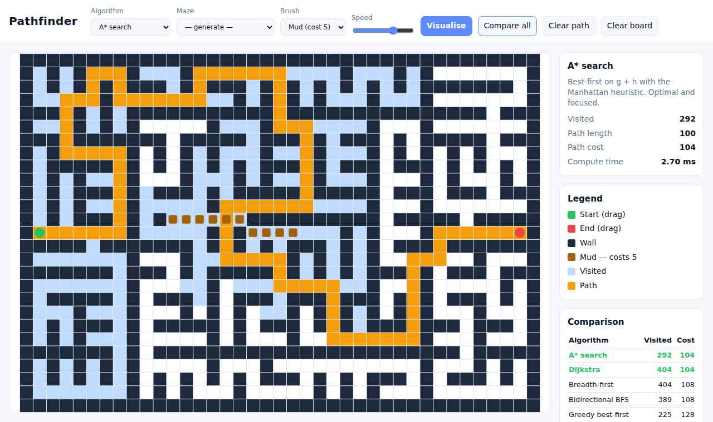

# Pathfinder — search algorithm visualiser

[](https://github.com/Sumitrcs/pathfinder-visualizer/actions/workflows/ci.yml) 

Draw walls and mud, generate a maze, then watch **A\***, **Dijkstra**,
**BFS**, **bidirectional BFS**, **greedy best-first** and **DFS** explore the
grid in real time. Built with plain JavaScript modules and `<canvas>` — no
framework, no build step.



## Features

- **Six algorithms** written as generators: each `yield` is one visited cell,
  so the same code powers both the animation and the unit tests
- **Weighted cells** ("mud", cost 5) — see Dijkstra and A\* route around mud
  while BFS walks straight through it
- **Maze generators**: recursive backtracker (perfect maze), recursive
  division (rooms and doors) and random obstacles — animated as they're built
- **Compare all** runs every algorithm on the current board and tabulates
  cells visited and path cost, highlighting the optimal ones
- Drag the start and end markers; paint with mouse, pen or touch (Pointer Events)
- Canvas rendering with devicePixelRatio scaling — sharp on retina screens, fast on large grids
- Light and dark themes follow the OS setting

## Algorithms

| Algorithm | Weighted | Shortest path | How it chooses the next cell |
|---|---|---|---|
| A\* | ✅ | ✅ | lowest `g + h` (cost so far + Manhattan distance to goal), ties to deeper nodes |
| Dijkstra | ✅ | ✅ | lowest `g` |
| Breadth-first | ❌ | ✅ (in steps) | FIFO queue |
| Bidirectional BFS | ❌ | ✅ (in steps) | two BFS frontiers, always expanding the smaller one |
| Greedy best-first | ✅ | ❌ | lowest `h` only |
| Depth-first | ❌ | ❌ | LIFO stack |

The priority queue is a binary min-heap with FIFO tie-breaking so every
run is deterministic.

## Run it

```bash
npm start            # or any static server: python3 -m http.server
```

Open the printed URL. ES modules need to be served over HTTP, not opened as a file.

## Tests

```bash
npm test
```

The test-suite checks that every algorithm returns a valid, connected path;
that the optimal algorithms agree; that weighted searches avoid mud while
BFS doesn't; that A\* explores less than a third of what Dijkstra does on
an open grid; that the backtracker produces a *perfect* maze (open cells =
2 × rooms − 1, i.e. a spanning tree); that recursive division always keeps
start and end connected; and that seeded generators are reproducible.

## Project layout

```
src/grid.js         grid model, neighbours, costs
src/heap.js         binary min-heap
src/algorithms.js   search generators + solve()
src/mazes.js        maze generators + seeded PRNG (mulberry32)
src/app.js          canvas rendering, animation, pointer input
```

## License

MIT © Sumit ([@Sumitrcs](https://github.com/Sumitrcs))
