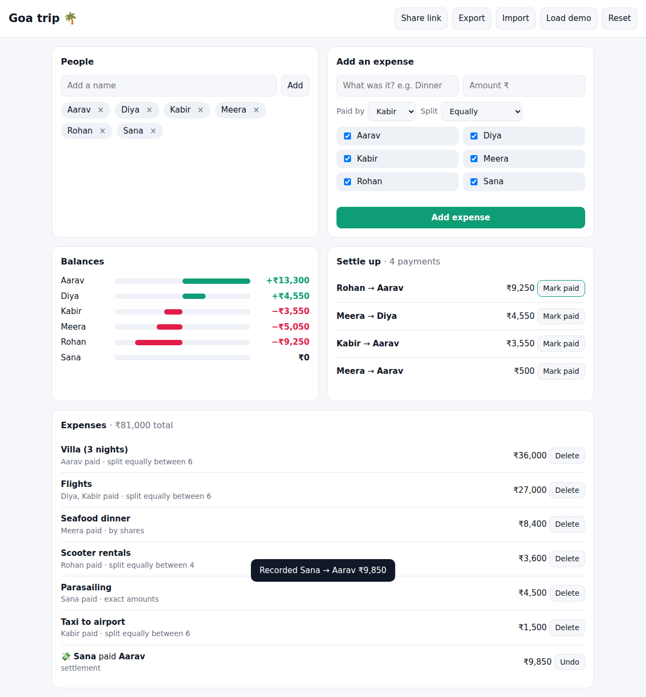

# Settle Up

Split trip, flat or office expenses fairly — then pay everyone back in the
**provably minimum number of transfers**. No sign-up, no server: everything
lives in your browser, and a group can be shared as a single link.



## Features

- **Four split modes**: equally (pick who's in), exact amounts, percentages, or shares
  (e.g. a couple counts as 2)
- **Multiple payers** per expense in the data model (the demo's flights were paid by two people)
- **Exact money**: amounts are integer paise and split with the
  *largest-remainder* method, so ₹1,000 ÷ 3 is ₹333.34 + ₹333.33 + ₹333.33 —
  never a paisa lost or invented
- **Optimal settlement** (see below) with one-click "Mark paid", which records
  a settlement and recalculates
- **Share by link**: the whole group is encoded (UTF-8 safe base64url) into the URL hash —
  nothing is uploaded anywhere
- Export / import JSON, works offline, dark mode, mobile friendly

## The algorithm

After computing each person's net balance, the question is: *what is the
smallest set of payments that zeroes every balance?*

The common approach — repeatedly have the biggest debtor pay the biggest
creditor — always works but can need up to *n − 1* payments even when fewer suffice.
The true minimum is

```
min payments = n − (maximum number of disjoint groups whose balances sum to 0)
```

because a group of *k* people whose balances cancel out can settle among
themselves with *k − 1* payments. Finding that maximum partition is NP-hard,
so for groups of up to 16 people with non-zero balances it is solved exactly
with a **bitmask dynamic programme** over all 2ⁿ subsets:

```
dp[mask] = max over p in mask of dp[mask without p]  +  (sum(mask) == 0 ? 1 : 0)
```

The partition is reconstructed from the DP and each group is settled
greedily. Larger groups fall back to greedy.

Example from the tests: balances `A −3, B +5, C +6, D −3, E +7, F −12`.
Greedy needs **5** payments; the optimal plan finds `{A, C, D}` and
`{B, E, F}` and needs **4**.

## Run

```bash
npm start            # or python3 -m http.server
```

## Tests

```bash
npm test
```

Covers rounding (every allocation sums exactly), all split modes and their
validation errors, balances with multiple payers and recorded settlements,
the greedy-vs-optimal example, and 200 randomized groups where every plan
must zero all balances in exactly *n − groups* payments.

## Project layout

```
src/money.js    paise conversion, INR formatting, largest-remainder allocation
src/split.js    split modes and net balances
src/settle.js   greedy and optimal (bitmask DP) settlement
src/store.js    localStorage + shareable URL encoding
src/app.js      UI
```

## License

MIT © Sumit ([@Sumitrcs](https://github.com/Sumitrcs))
